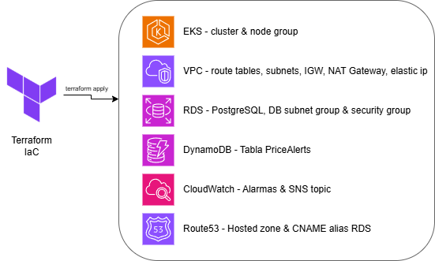

# Terraform-TFG


The source code in this repository includes the Terraform configuration files used to provision the infrastructure of the AWS Learner Lab for my bachelor's degree project. Except the configuration of Simple Queue Service (SQS), Simple Notification Service (SNS) and Lambda Function for the re-scheduler, all the infrastructure is provided in these configuration files.

The complete explanation of the project can be found in my [TFG](https://azuar4e.github.io/en/posts/tfg) article on my blog.

## Overview



As we can see in the image above, terraform deploys the following services:

- An Elastic Kubernetes Service (EKS) cluster, for the orchestration of the microservices and the installation of [FluxCD](https://github.com/azuar4e/flux-repo-tfg).
- Virtual Private Cloud (VPC) to host all the services, with two public and two private subnets in two different availability zones, route tables, an Elastic IP for the NAT Gateway, and an Internet and Nat gateway for internet access.
- PostgreSQL Relational Database Service (RDS), where information about the users is stored. Additionally, a security group to limit the access to only the worker nodes of the EKS cluster.
- DynamoDB table for the job information.
- CloudWatch alarms for RDS CPU, Lambda errors, SQS length and EKS node CPU.
- Route53 to create a CNAME for the RDS endpoint.

In addition, an S3 backend has been configured to store the Terraform state file remotely, using the **cloudposse/tfstate-backend** module, which provisions the S3 bucket and DynamoDB lock table.

```hcl
module "terraform_state_backend" {
  source = "cloudposse/tfstate-backend/aws"
  # Cloud Posse recommends pinning every module to a specific version
  # version     = "x.x.x"
  namespace  = "tfg"
  stage      = "dev"
  name       = "azuar4e"
  attributes = ["state"]

  terraform_backend_config_file_path = "."
  terraform_backend_config_file_name = "backend.tf"
  force_destroy                      = true
}
```

## Usage

To use this repo, once cloned you have to configure your AWS credentials with the amazon cli:

```bash
aws configure
```

Then it will be ready to deploy:

```bash
cd environments/
terraform apply
```

## Requirements

- Terraform v1.14.4+
- AWS credentials configured
